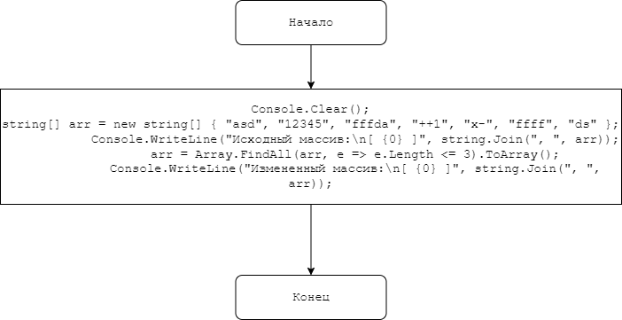

# Итоговая проверочная работа  

- [x] Создать репозиторий GitHub
- [x] Нарисовать блок-схему алгоритма
- [x] Снабдить репотизорий оформленным текстовым описанием решения
- [x] Написать программу
- [x] Использовать контроль версий

## Задание
>Написать программу, которая из имеющего массива строк формирует новый массив из строк, длина которых меньше либо равна 3 символа.


## Блок-схема


## Пример работы схемы

```Csharp
{ "asd", "12345", "fffda", "++1", "x-", "ffff", "ds" } //Исходный массив
```

Результат выполнения алгоритма:
```
Исходный массив:
[ asd, 12345, fffda, ++1, x-, ffff, ds ]
Измененный массив:
[ asd, ++1, x-, ds ]
```
